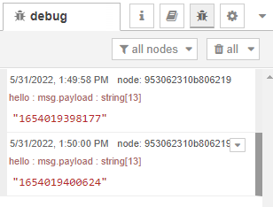

# IoT Application Server

## Objective

Our goal in this lab is to develop an application server that can be used for processing and visualizing IOT data with open source software. The application server can be used with data from any source that supports the ability to output data to an MQTT stream.


## Getting Started

These instructions will take you through setting up a Node-RED dashboard.

__In this lab you will__
1. Set Up the MQTT Data Flow
2. Format the Data
3. Create a Basic Dashboard

__You will need:__
* Node.js
* Node-RED
* Mosquitto
* MQTT

## Node-RED Set Up

### Installation

1. [Install](https://nodejs.org/en/download/) the latest LTS version of Node.js
    1. To verify whether this was installed properly run ```node -v``` and ```npm -v``` (the system should display what node and npm version is installed on your system)
2. [Install](https://nodered.org/docs/getting-started/local) Node-RED locally with npm

### Check

1. Check whether you installed it correctly by running ```node-red``` in your terminal
2. Navigate to http://localhost:1880/ which should automatically direct you to your flow (unless you changed the port number in configuration)

### Security

Follow [this tutorial](https://stevesnoderedguide.com/securing-node-red-ssl) on setting up a username and password to secure your Node-RED flows.

## MQTT Set Up

### Moquitto Installation
1. Install Mosquitto
    1. Use this [link](http://www.steves-internet-guide.com/install-mosquitto-broker/) for Windows
    2. Use this [link](http://www.steves-internet-guide.com/install-mosquitto-linux/) for Linux
2. Make sure it is installed correctly by running ```mosquitto -h``` in your mosquitto folder
    1. Another way to check is by running ```netstat -na``` and looking for a listener on port 1883 (unless you changed it from the default in your configuration file)


### Mosquitto Configuration

Configure your Mosquitto MQTT broker with username and password [here](http://www.steves-internet-guide.com/mqtt-username-password-example/)

### Mosquitto Validation

Validate and troubleshoot Mosquitto connectivity and authenication issues [here](http://mqtt-explorer.com/)

## Setting Up Your Node-RED Flow
1. Set up your publishing flow like this


2. Set up your subscribing flow like this


3. Configure your MQTT nodes by making sure that they have the ```same topic``` and are on the ```same server```
    1. If you set up a username and password, make sure you enter that information into the security tab when you edit the MQTT server

4. You should be able to see the timestamp in your debug window if you press on the inject node



## Formatting the Data

Right now, our timestamp is in a number format, but we want to convert it into a Date. Here we use a function node to format our data.


Your subscribing flow should look like this


## Making a Dashboard

Attach a text node and make a new dashboard group and tab to contain it. After clicking on the inject node, your dashboard (at the URL http://localhost:1880/ui/) should look like this.


Your Node-RED flow should look like this


## Conclusion

In this lab, you learned how to set up and install Node-RED and Mosquitto (an MQTT broker). You formatted data from the MQTT data stream and created a basic dashboard for people to view.

## Next Steps

Check out some extensions to this basic app server

* Improve your UI using our [grafana documentation](https://github.com/ciscops/grafana-dashboard)
* Set up email or webex alerts with our [node red alert documentation](https://github.com/ciscops/node-red-alerts)
* Integrate your location data with TAK clients through our [node red TAK documentation](https://github.com/ciscops/node-red-tak)